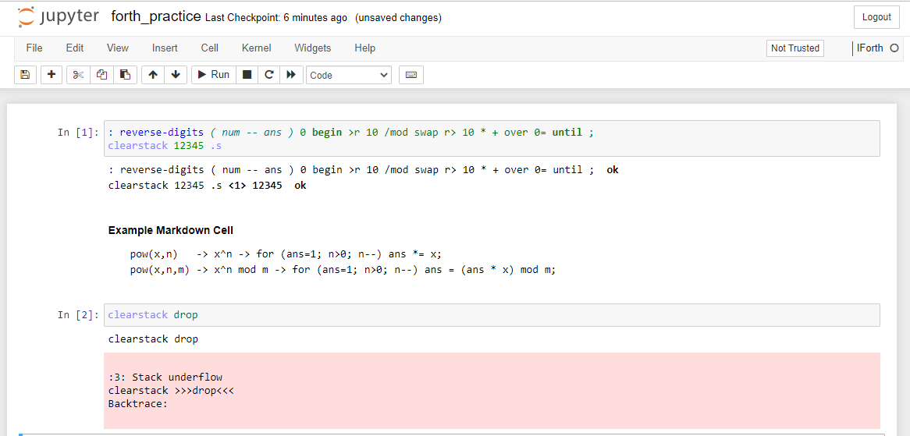

# IForth
Forth kernel for Jupyter notebook / lab. This is a fork of [github.com/jdfreder/iforth](https://github.com/jdfreder/iforth).



## Installation
- Install [Gforth](https://www.gnu.org/software/gforth/).  Make sure it is accessible via the commandline/terminal (`gforth --version`).
- Run `pip install forth_kernel`

**Note:** On Windows, `gforth` doesn't work. Instead, [run using docker](#installing-with-docker)

### Development Installation
Clone this repository and do an [editable `pip` install](https://pip.pypa.io/en/stable/topics/local-project-installs/#editable-installs) in this repository's folder:
```bash
pip install -e .
jupyter kernelspec install ./kernelspec --user   
```

### Installing with Docker
- Clone this repo and `cd` to project root.
- Build the docker image: `docker build -t iforth-testing . --build-arg version=testing`
- Run it: `docker run --rm -it -v ${PWD}:/home/jovyan/project -p 8888:8888 iforth-testing`
  This mounts your current working directory as */home/jovyan/project* in the docker container.

## Usage
- Run `jupyter notebook` (or `jupyter lab`, whichever you prefer).
- In a new or existing notebook, use the kernel selector (located at the top right of the notebook) to select `IForth`.

## TODO
- Unit Tests
- Github CI / CD

## BUGS
- In Dockerfile, versions *stable* and *development* are not working. Only *testing* version works.
